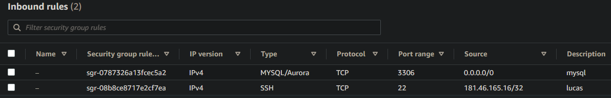
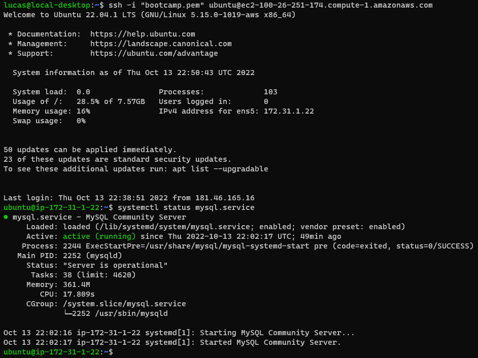

## Desafio 1
Instalar MySQL 8 con en dos instancias EC2 de Amazon.
Una en AWS Linux 2 y otra en Ubuntu.

---

### Security group


---

### Ubuntu
```
aws ec2 run-instances --image-id ami-08c40ec9ead489470 --instance-type t3.medium --key-name bootcamp --security-group-ids sg-09c02c848706b7424 --count 1 --user-data file://mysql-ubuntu.sh --tag-specifications 'ResourceType=instance,Tags=[{Key=Name,Value=Ubuntu}]'
```

```
mysql-ubuntu.sh

#!/bin/bash
apt update -y
apt-get install mysql-server -y
apt-get install sed -y
sed -i 's/127.0.0.1/0.0.0.0/g' "/etc/mysql/mysql.conf.d/mysqld.cnf"
mysql -e "CREATE USER 'ubuntu'@'%' IDENTIFIED WITH mysql_native_password BY 'ubuntupass';"
mysql -e "GRANT PRIVILEGE ON *.* TO 'ubuntu'@'%';"
mysql -e "FLUSH PRIVILEGES;"
systemctl restart mysql
```



---

### AWS Linux 2
```
aws ec2 run-instances --image-id ami-026b57f3c383c2eec --instance-type t3.medium --key-name bootcamp --security-group-ids sg-09c02c848706b7424 --count 1 --user-data file://mysql-awslinux2.sh --tag-specifications 'ResourceType=instance,Tags=[{Key=Name,Value=Amazon Linux 2}]'
```

```
mysql-awslinux2.sh

#!/bin/bash
yum update -y
yum install -y https://dev.mysql.com/get/mysql80-community-release-el7-5.noarch.rpm
amazon-linux-extras install epel -y
yum -y install mysql-community-server
systemctl enable --now mysqld
temp_password=$(grep password /var/log/mysqld.log | awk '{print $NF}')
echo "ALTER USER 'root'@'localhost' IDENTIFIED BY 'awslinuxpass'; flush privileges;" > reset_pass.sql
mysql -u root --password="$temp_password" --connect-expired-password < reset_pass.sql
mysql -u root --password="awslinuxpass" -e "CREATE USER 'awslinux'@'%' IDENTIFIED BY 'awslinuxpass'; GRANT ALL PRIVILEGES ON *.* TO 'awslinux'@'%'; FLUSH PRIVILEGES;"
```


---
