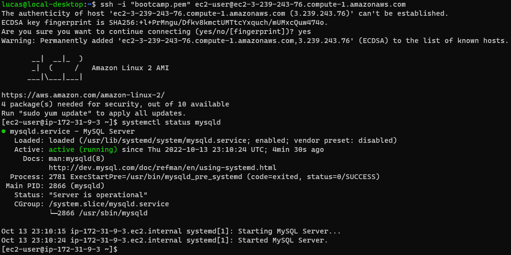

## Desafio 1
Instalar Mysql 8 con en dos instancias EC2 de Amazon.
Una en AWS Linux 2 y otra en Ubuntu.

---

### Security group


---

### Ubuntu
```
aws ec2 run-instances --image-id ami-08c40ec9ead489470 --instance-type t3.medium --key-name bootcamp --security-group-ids sg-09c02c848706b7424 --count 1 --user-data file://mysql-ubuntu.sh --tag-specifications 'ResourceType=instance,Tags=[{Key=Name,Value=Ubuntu}]'
```

```
mysql-ubuntu.sh
#!/bin/bash
sudo apt-get update     
sudo apt install mysql-server -y 
systemctl start mysql.service
```


---

### AWS Linux 2
```
aws ec2 run-instances --image-id ami-026b57f3c383c2eec --instance-type t3.medium --key-name bootcamp --security-group-ids sg-09c02c848706b7424 --count 1 --user-data file://mysql-awslinux2.sh --tag-specifications 'ResourceType=instance,Tags=[{Key=Name,Value=Amazon Linux 2}]'
```

```
mysql-awslinux2.sh
#!/bin/bash
sudo amazon-linux-extras install epel -y
sudo yum install https://dev.mysql.com/get/mysql80-community-release-el7-5.noarch.rpm -y
sudo yum install mysql-community-server -y
systemctl active mysqld
systemctl start mysqld 
```

