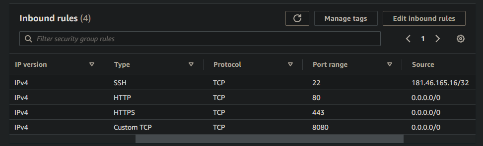

## Desafio 2

Detalles del desafio:
https://docs.google.com/document/d/1V13_v173ojKs67vxWGT_p8ZbnxEKpTRL/edit

---

### Security Group



---

### User Data
```
#!/bin/bash
DOMAIN=$(curl icanhazip.com)
SSLIP="$DOMAIN.sslip.io"
sudo apt update -y
sudo apt install -y wget unzip nginx
sudo systemctl start nginx
sudo mkdir -p /var/www/jenkins/html
sudo chown -R $USER:$USER /var/www/jenkins/html
sudo chmod -R 755 /var/www/jenkins
cat > jenkins <<EOF
server {
        listen 80;
        listen [::]:80;
        root /var/www/jenkins/html;
        index index.html index.htm index.nginx-debian.html;
        server_name $SSLIP www.$SSLIP;
        location / {
                #try_files $uri $uri/ =404;
                proxy_pass    http://$SSLIP:8080;
                proxy_read_timeout  90s;
        }
}
EOF
sudo mv jenkins /etc/nginx/sites-available/
sudo ln -s /etc/nginx/sites-available/jenkins /etc/nginx/sites-enabled/
sudo systemctl restart nginx
sudo apt install -y certbot python3-certbot-nginx
sudo certbot --nginx --register-unsafely-without-email --agree-tos -d "${SSLIP}" --cert-name jenkins
curl "https://awscli.amazonaws.com/awscli-exe-linux-x86_64.zip" -o "awscliv2.zip"
unzip awscliv2.zip
sudo ./aws/install
wget -q -O - https://pkg.jenkins.io/debian-stable/jenkins.io.key |sudo gpg --dearmor -o /usr/share/keyrings/jenkins.gpg
sudo sh -c 'echo deb [signed-by=/usr/share/keyrings/jenkins.gpg] http://pkg.jenkins.io/debian-stable binary/ > /etc/apt/sources.list.d/jenkins.list'
sudo apt update -y
sudo apt install -y default-jre
sudo apt install -y jenkins 
sudo systemctl start jenkins.service
```

---

### EC2
```
aws ec2 run-instances --image-id ami-08c40ec9ead489470 --instance-type t3.medium --key-name bootcamp --security-group-ids sg-078a92ed618fabc54 --count 1 --user-data file://user_data.sh --tag-specifications 'ResourceType=instance,Tags=[{Key=Name,Value=Desafio2-ec2}]'
```

---

### EBS (No fue necesario realizar este paso)

Create EBS volume:
```
aws ec2 create-volume --size 30 --availability-zone us-east-1a --tag-specifications 'ResourceType=volume,Tags=[{Key=Name,Value=Desafio2-ebs}]'
```

Attach EBS volume to EC2 instance:
```
aws ec2 attach-volume --instance-id i-087cccf3b53beda55 --volume-id vol-0ee4f4f86d40d1588 --device /dev/sda1
```

---

### Jenkins
```
ubuntu@ip-172-31-4-154:~$ sudo cat /var/lib/jenkins/secrets/initialAdminPassword
0a15da0ccaf74881a2d7edf2a00dc837
```

