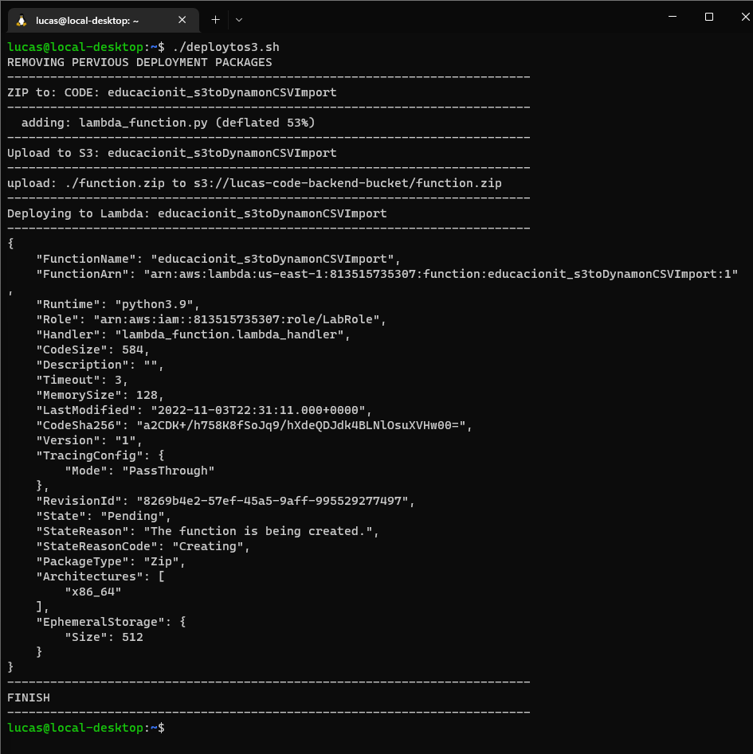
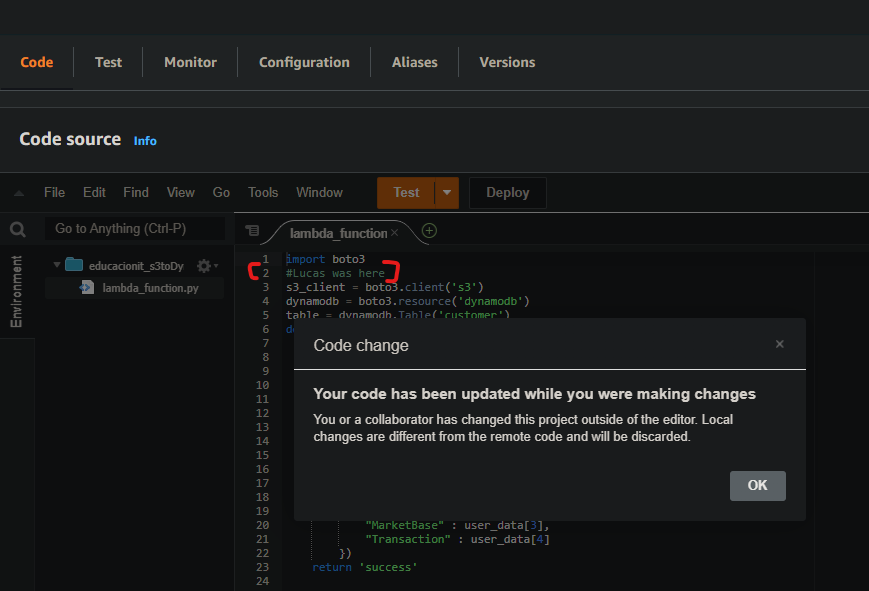
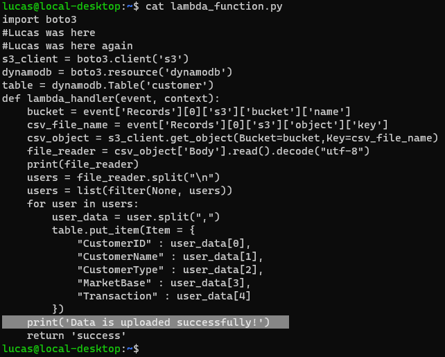
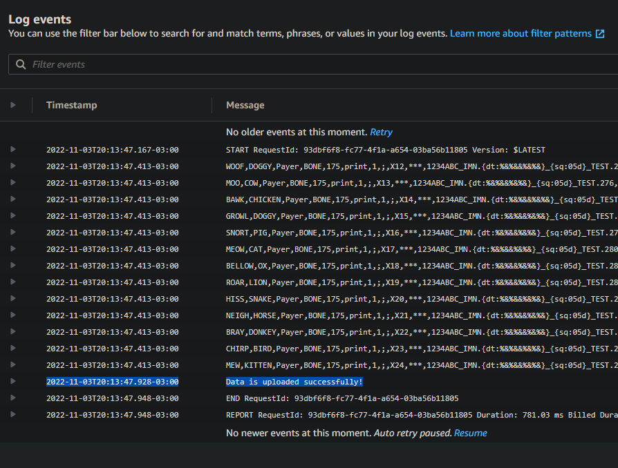

## Desafio 3

https://docs.google.com/document/d/1uiNt5gyzht58Z5L4bnEt5ahjttInB33wsbB-Y3cpes4/edit

---

### Update Lambda function code using S3 bucket

```
#!/bin/bash

#Despliegue usando s3

FUNCTION_NAME=educacionit_s3toDynamonCSVImport
ZIP=function.zip
BUCKETS3=lucas-code-backend-bucket
CODE="lambda_function.py"

#remove zip
echo "REMOVING PERVIOUS DEPLOYMENT PACKAGES"
rm -rf $ZIP

echo "-------------------------------------------------------------------------"
echo "ZIP to: CODE: $FUNCTION_NAME"
echo "-------------------------------------------------------------------------"

zip -jr $ZIP $CODE

echo "-------------------------------------------------------------------------"
echo "Upload to S3: $FUNCTION_NAME"
echo "-------------------------------------------------------------------------"

aws s3 cp $ZIP s3://${BUCKETS3}

echo "-------------------------------------------------------------------------"
echo "Deploying to Lambda: $FUNCTION_NAME"
echo "-------------------------------------------------------------------------"
aws lambda update-function-code --function-name $FUNCTION_NAME --s3-bucket ${BUCKETS3} --s3-key $ZIP --publish

echo "-------------------------------------------------------------------------"
echo "FINISH"
echo "-------------------------------------------------------------------------"
```






### En este csao, la función Lambda va a correr cuando detecte un cambio en el bucket S3


Vuelvo a modificar el codigo:




Vuelvo a correr deploytos3.sh para subir el codigo a la Lambda.

Y para volver a triggerear el Lamda tengo que volver a subir el .csv en el bucket S3 para forzarlo a correr y que se vea reflejado el cambio de codigo:



