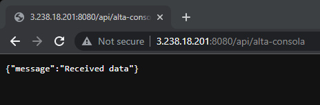

# Solución

### Security group


```Bash
lucas@local-desktop:~$ chmod 400 bootcamp.pem
```

---
### Key pair


Le doy permisos a la key:
```Bash
lucas@local-desktop:~$ chmod 400 bootcamp.pem
```

---

### Comandos de AWS CLI para iniciar la instancia EC2:
 
```
aws ec2 run-instances --image-id ami-08c40ec9ead489470 --instance-type t3.medium --key-name bootcamp --security-group-ids sg-0069e875d265b68dc --count 1 --user-data file://user_data.sh --tag-specifications 'ResourceType=instance,Tags=[{Key=Name,Value=ec2-challenge}]'
```

---

### user_data.sh
```bash
#!/bin/bash     
sudo apt-get update
curl -fsSL https://deb.nodesource.com/setup_16.x | sudo -E bash - &&\
sudo apt-get install nodejs git -y
sudo apt install nginx -y
sudo systemctl enable nginx     
sudo systemctl start nginx
git clone https://github.com/roxsross/bootcamp-ec2-challenge.git
cd bootcamp-ec2-challenge
npm install
npm run start
```

---
### Resultado final


