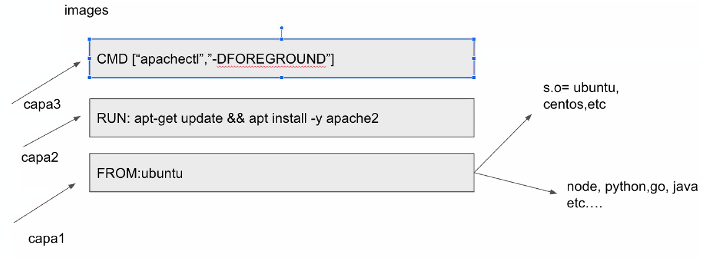
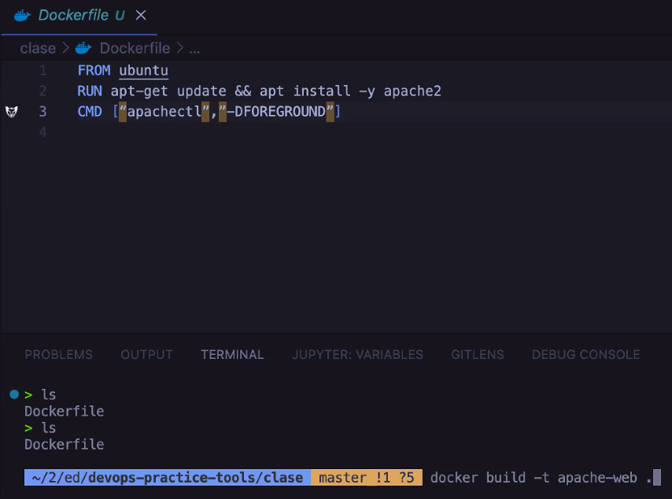
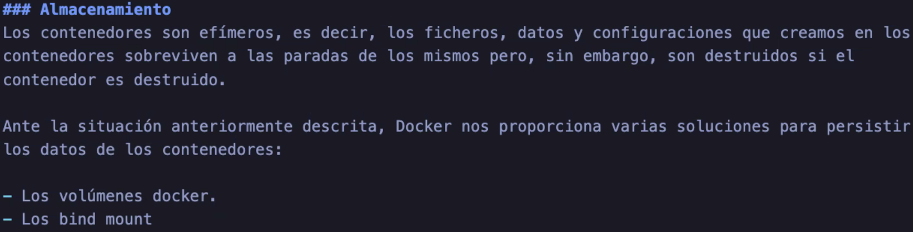
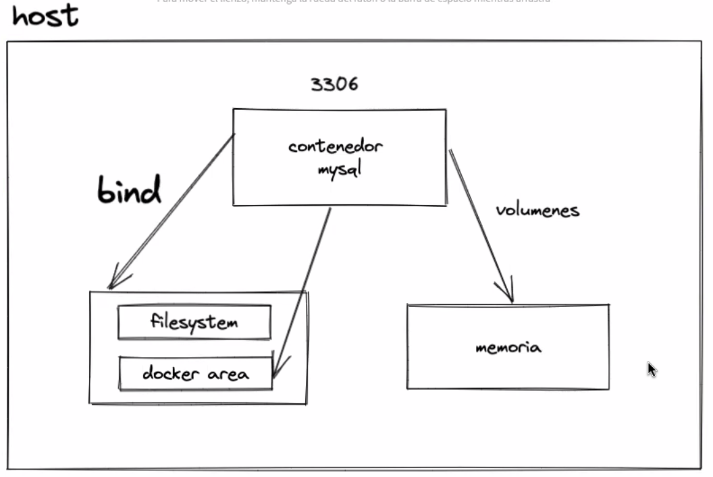
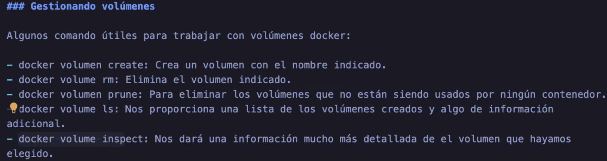
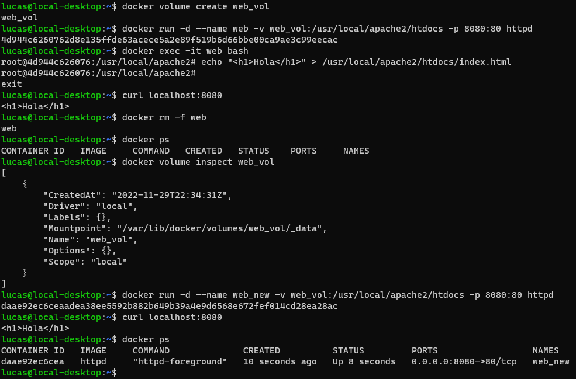
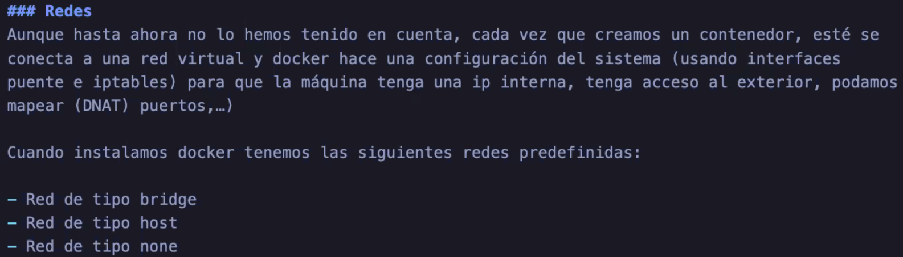
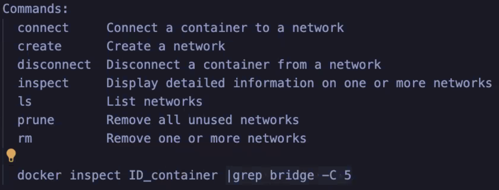

## Docker


---

Cheat sheet:
* https://dockerlabs.collabnix.com/docker/cheatsheet/
* https://www.docker.com/wp-content/uploads/2022/03/docker-cheat-sheet.pdf
* docker --help

---

### Docker Run


---

### Comandos utiles

``docker run`` = iniciar un contenedor 

``docker images`` = listar imagenes (publicas o propias)

``docker ps`` = listar contenedores en ejecucion

``docker stop`` = detener contenedores

``docker start`` = iniciar un contenedor ya creado

``docker ps -a`` = listar contenedores en ejecucion, fallados o stoppeados

``docker pull`` = descargar imagen de un repo (docker-hub)

``docker exec`` = entrar a un contenedor (bash o shell)

``docker inspect`` = ver info detallada del containerID

``docker rm`` = borrar contenedor


---

### Instalando Jenkins


---

### Variables de entorno

Variables necesarias por contenedores a la hora de iniciar.

``docker run -d -e "var1=value1" -p 82:80 nginx``

-e = --env


---

### Copiar cosas desde y hacia contenedores

``docker cp``

Traer desde un contenedor:

``docker cp reverent_almeida:/usr/local/apache2/htdocs/index.html .``

Enviar al contenedor:

``docker cp index.html reverent_almeida:/usr/local/apache2/htdocs/``


---

### Custom Images - Dockerfile








```
FROM ubuntu     
RUN apt-get update && apt install -y apache2       
CMD ["apachectl","-DFOREGROUND"]    
```

``docker build -t apache-web .``


---

### Docker Hub


Pasos para usar el registry de Docker Hub:

```
docker login -u docker-registry_name

docker build -t nombre_imagen:etiqueta path_to_Dockerfile

docker tag nombre_imagen:etiqueta username_dockerhub/nombre_imagen:etiqueta

docker push username_dockerhub/nombre_imagen:etiqueta
```

---

## Almacenamiento









### Ejemplo:
Creo un volumen, lo enlazo a un contenedor y cambio archivos dentro del volumen:



---

## Redes






`$ docker network create red_guestbook`

`$ docker volume create guestbook_vol`   

Para ejecutar los contenedores:

```

docker run -d --name redis --network red_guestbook -v guestbook_vol:/data redis redis-server --appendonly yes


$ docker run -d -p 80:5000 --name guestbook --network red_guestbook roxsross12/guestbook

---


docker network create red_wp
docker volume create vol_wp

docker run -d --name servidor_mysql --network red_wp -v vol_wp:/var/lib/mysql -e "MYSQL_DATABASE=bd_wp" -e "MYSQL_USER=user_wp" -e "MYSQL_PASSWORD=12345678" -e "MYSQL_ROOT_PASSWORD=admin" -p 3306:3306 mariadb

docker run -d --name wp --network red_wp -v vol_wp:/var/www/html/wp-content -e "WORDPRESS_DB_HOST=servidor_mysql" -e "WORDPRESS_DB_USER=user_wp" -e "WORDPRESS_DB_PASSWORD=12345678" -e "WORDPRESS_DB_NAME=bd_wp" -p 80:80 wordpress
