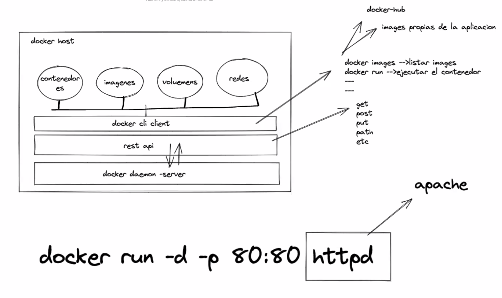
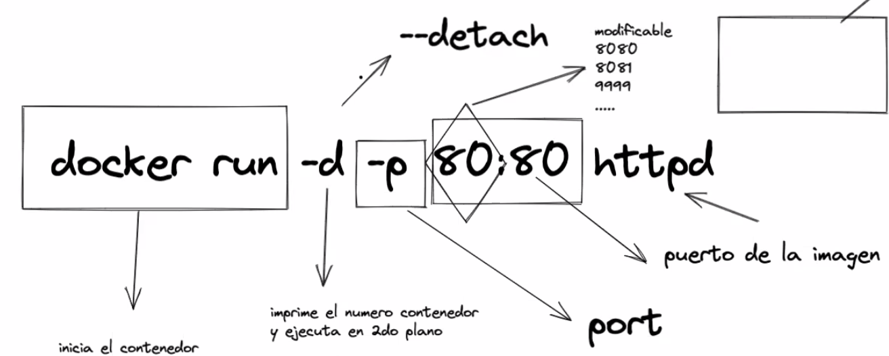
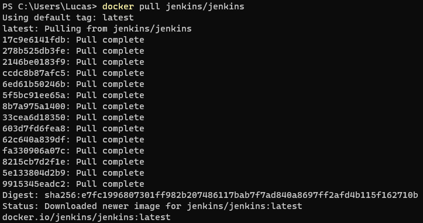
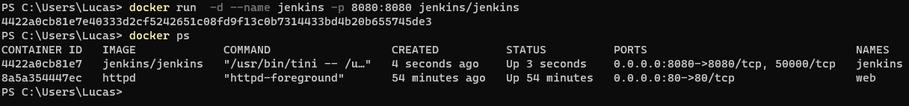
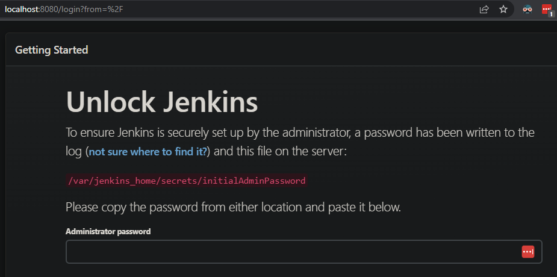
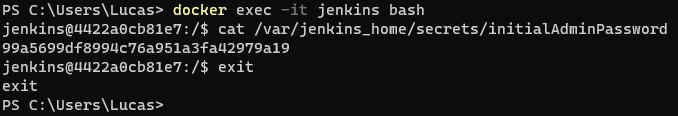
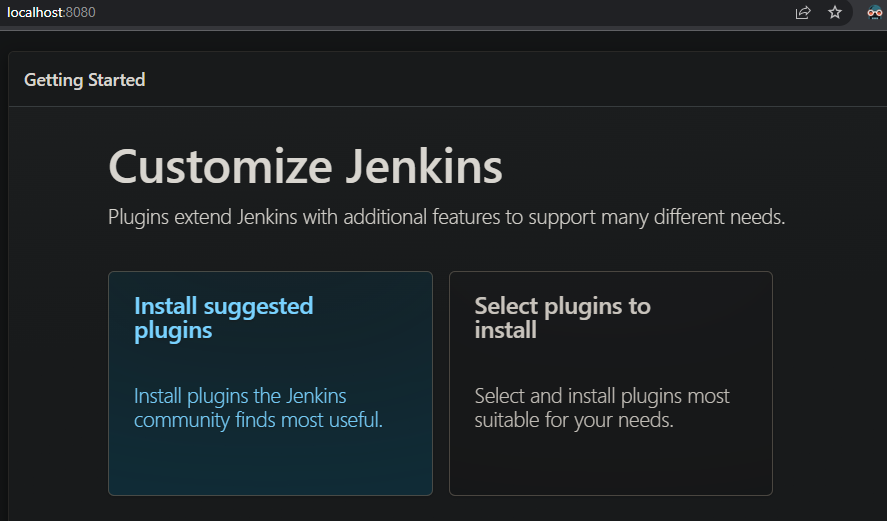
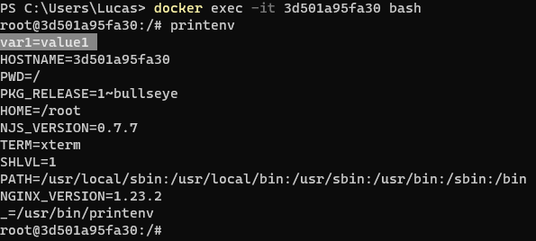

## Docker

---

Cheat sheet:
* https://dockerlabs.collabnix.com/docker/cheatsheet/
* https://www.docker.com/wp-content/uploads/2022/03/docker-cheat-sheet.pdf
* docker --help

---

### Docker Run

---

### Comandos utiles

``docker run`` = iniciar un contenedor 

``docker images`` = listar imagenes (publicas o propias)

``docker ps`` = listar contenedores en ejecucion

``docker stop`` = detener contenedores

``docker start`` = iniciar un contenedor ya creado

``docker ps -a`` = listar contenedores en ejecucion, fallados o stoppeados

``docker pull`` = descargar imagen de un repo (docker-hub)

``docker exec`` = entrar a un contenedor (bash o shell)

``docker inspect`` = ver info detallada del containerID

``docker rm`` = borrar contenedor

---

### Instalando Jenkins

---

### Variables de entorno

Variables necesarias por contenedores a la hora de iniciar.

``docker run -d -e "var1=value1" -p 82:80 nginx``

-e = --env

---